<div align="center">


<br/>

[](https://linkedin.com/in/vanderson-lopes-amaral)
[](https://amaraldev.me)
[](https://github.com/vandersonamaral)

</div>

---

## Sobre mim

```java
public class Vanderson extends Developer {

    String name        = "Vanderson Lopes Amaral";
    String education   = "Análise e Desenvolvimento de Sistema — IFNMG";
    String focus       = "Full Stack | Back-end com Java & Spring Boot";
    String[] stack     = { "Java", "Spring Boot", "Node.js", "TypeScript", "React Native" };
    String portfolio   = "https://amaraldev.me";
    boolean openToWork = true;
}
```

---

## Stack

<div align="center">

**Back-end**


**Front-end & Mobile**


**Banco de Dados & Ferramentas**


</div>

---

<div align="center">




</div>

---

<div align="center">


**Aberto a oportunidades de Back-end e Full Stack Júnior**
<br/>
[amaraldev.me](https://amaraldev.me) · [LinkedIn](https://linkedin.com/in/vanderson-lopes-amaral)

</div>
